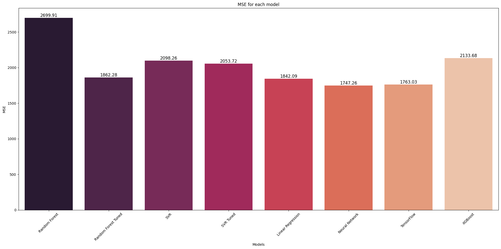

# Python for Data Analysis: Landslide after Rainfall

A4 Python for data analysis project

## Introduction

Landslides are natural disasters with global impacts, causing significant loss of life and property. This project focuses on leveraging Python for data analysis and machine learning to predict the impact of landslides, specifically the number of fatalities. By utilizing the Global Landslide Catalog Export dataset from NASA, our goal is to develop a predictive model that can contribute to early warning systems and disaster management efforts.

## Dataset Overview

The dataset is sourced from the Global Landslide Catalog (GLC), established by NASA in 2007. It systematically documents rainfall-triggered landslide events worldwide, providing a comprehensive repository of information. Key features include event details, landslide characteristics, geographical information, and more.

### Key Dataset Features:

The different columns of our dataset are

| Column Name               | Description                      |
| ------------------------- | -------------------------------- |
| source_name               | Name of the source of the data   |
| source_link               | Link to the source of the data   |
| event_id                  | ID of the event                  |
| event_date                | Date of the event                |
| event_time                | Time of the event                |
| event_title               | Title of the event               |
| event_description         | Description of the event         |
| location_description      | Description of the location      |
| location_accuracy         | Accuracy of the location         |
| landslide_category        | Category of the landslide        |
| landslide_trigger         | Trigger of the landslide         |
| landslide_size            | Size of the landslide            |
| landslide_setting         | Setting of the landslide         |
| fatality_count            | Number of fatalities             |
| injury_count              | Number of injuries               |
| storm_name                | Name of the storm                |
| photo_link                | Link to the photo                |
| notes                     | Notes                            |
| event_import_source       | Source of the import             |
| event_import_id           | ID of the import                 |
| country_name              | Name of the country              |
| country_code              | Code of the country              |
| admin_division_name       | Name of the admin division       |
| admin_division_population | Population of the admin division |
| gazeteer_closest_point    | Closest city                     |
| gazeteer_distance         | Distance to the closest city     |
| submitted_date            | Date of submission               |
| created_date              | Date of creation                 |
| last_edited_date          | Date of last edition             |
| longitude                 | Longitude                        |
| latitude                  | Latitude                         |

## Project Structure Overview

The project is hosted on GitHub under the repository [Python-data-analysis](https://github.com/Mcrash01/Python-data-analysis), with contributions from QIAN Victor and RAMPONT Martin. The repository is organized into several folders and files, each serving a specific purpose in the Python data analysis project.

### Folders:

1. **app**: Central to the development of a Streamlit application, including files for initialization, project structure documentation, application creation, data analysis, documentation handling, homepage, map-related functionalities, and machine learning models.
2. **data**: Contains the crucial Global Landslide Catalog (GLC) CSV file, serving as the primary dataset for analysis.
3. **model**: Includes the `model.py` file, presumed to house code related to machine learning model creation and training.
4. **src/img**: Stores images used within the project.

### Files:

- `.gitignore`: Specifies intentionally untracked files to be ignored by Git.
- `README.md`: Main documentation or guide for users/contributors.
- `exploration.ipynb`: Jupyter Notebook showcasing exploration activities.
- `landslide_prediction.ipynb`: Jupyter Notebook likely dedicated to landslide prediction, showcasing model implementation and evaluation.
- `requirements.txt`: Specifies necessary dependencies or packages for the project.

## Results

Feel free to explore the project repository and contribute to enhancing our understanding and mitigation strategies for landslides.
